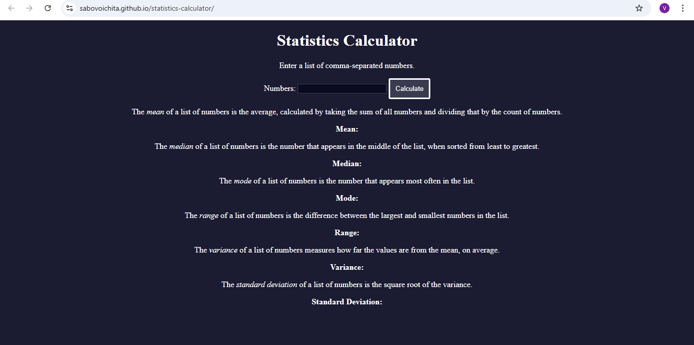

# Statistics Calculator

In this statistics calculator project, you'll gain experience with handling user input, DOM manipulation, and method chaining. You'll get practice by performing statistical calculations like mean, median, mode, variance, and standard deviation.

Statistics is a way of using math to make sense of data. It helps us understand patterns and trends in information, so we can make predictions and decisions based on that information.

# [live](https://sabovoichita.github.io/statistics-calculator/)

